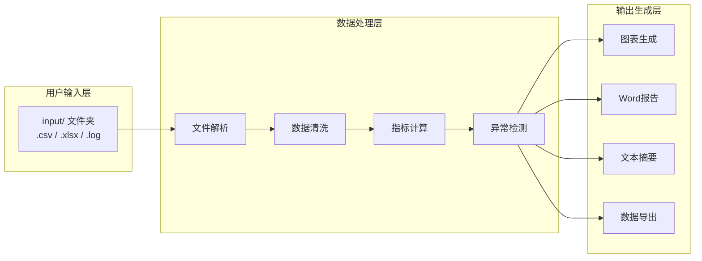

# Rectifier Validation Report Generator

> 整流器验证报告自动生成工具 — 让测试数据到专业报告的全流程自动化

[](https://www.python.org/)
[](LICENSE)
[]()

---

## 📖 项目简介

在电力电子产品的验证测试中，工程师通常需要手动处理大量测试数据——从 CSV/Excel 中复制数据、计算指标、绘制图表、撰写 Word 报告。这一过程重复、耗时且容易出错。

**Rectifier Validation Report Generator** 是一个基于 Python 的自动化工具，能够：

- 自动读取多种格式的测试数据（CSV / Excel / 文本日志）
- 计算关键性能指标（效率、功率、温度等）
- 执行阈值异常检测与统计
- 生成带异常标记的专业图表
- 一键输出完整的 Word 验证报告

---

## ✨ 核心特性

| 特性 | 说明 |
| :--- | :--- |
| 📂 **多格式输入** | 支持 `.csv`、`.xlsx`、`.xls`、`.log`、`.txt` 格式 |
| 🔍 **智能日志解析** | 基于正则表达式自动提取电压、电流、温度等参数 |
| 📊 **自动计算** | 输出功率、效率等关键指标自动计算 |
| 🔴 **异常检测** | 可配置阈值的异常识别 + 超标样本统计与定位 |
| 📈 **专业图表** | Matplotlib 生成 4 张曲线图（效率/电压/温度/功率），异常点高亮标记 |
| 📄 **Word 报告** | 自动生成完整验证报告，含摘要、评估、图表、结论 |
| ⚙️ **配置化管理** | 阈值、输入/输出路径等参数通过 `config.yaml` 集中管理 |
| 📦 **数据追溯** | 保存处理后的完整数据（含计算列），便于二次分析 |

---

## 🏗️ 技术架构



---

## 🚀 快速开始

### 环境要求

- Python 3.9 或更高版本
- pip 包管理工具

### 安装

```bash
# 1. 克隆项目
git clone https://github.com/October-j-log/Report-Gen.git
cd Report-Gen

# 2. 安装依赖
pip install -r requirements.txt
```
---

## ⚙️ 配置说明

### config.yaml 详细说明

```yaml
thresholds:
  efficiency_min: 90.0    # 效率低于此值 → 标记为异常
  temperature_max: 50.0   # 温度高于此值 → 标记为异常

input:
  folder: "input"        # 输入文件夹名称
  supported_formats:     # 支持的文件扩展名
    - .csv
    - .xlsx
    - .xls
    - .log
    - .txt

output:
  graphs_folder: "graphs"       # 图表输出文件夹
  reports_folder: "reports"     # 报告输出文件夹
  data_folder: "csv file"       # 处理后数据文件夹
  report_filename: "rectifier_report.docx"  # Word 报告文件名
  ```
注意：修改 config.yaml 后无需修改代码，直接重新运行即可生效。

## 📊 输出说明

### 1. 图表（`graphs/`）

| 文件 | 内容 | 异常标记 |
| :--- | :--- | :--- |
| `efficiency.png` | 效率 vs 样本序号 | ✅ 红色圆点标记低于阈值的点 |
| `output_voltage.png` | 输出电压 vs 样本序号 | ❌ |
| `temperature.png` | 温度 vs 样本序号 | ✅ 红色圆点标记高于阈值的点 |
| `output_power.png` | 输出功率 vs 样本序号 | ❌ |

### 2. Word 报告（`reports/rectifier_report.docx`）

完整报告包含以下章节：

1. **Objective** — 测试目标说明
2. **Test Setup** — 测试配置描述
3. **Validation Summary** — 统计指标 + 异常统计
4. **Test Evaluation** — PASS/FAIL 判定结果
5. **Observations** — 基于阈值的观测结论
6. **Graphs** — 4 张插入的图表
7. **Conclusion** — 最终通过/未通过结论

### 3. 文本摘要（`reports/validation_summary.txt`）

包含统计值和异常统计的纯文本文件，适合快速查阅或归档。

### 4. 处理后数据（`csv file/processed_rectifier_data.csv`）

原始数据 + 新增计算列：

| 新增列 | 说明 |
| :--- | :--- |
| `Output_Power_kW` | 输出功率 (kW) |
| `Efficiency` | 效率 (%) |

---

## 🧪 日志格式支持

工具支持从文本日志中解析数据。以下格式均可识别：

**格式 1 — 中文标记：**

```plaintext
电压=680.2V, 电流=35.4A, 温度=36.5°C
```

**格式 2 — 英文标记：**
```plaintext
Voltage: 680.2 V, Current: 35.4 A, Temp: 36.5 C
```

**格式 3 — 简写标记：**
```plaintext
V=680.2 I=35.4 T=36.5
```

**格式 4 — 通用数值提取（兜底）：**
```plaintext
2026-08-01 14:23:15 | 680.2 | 35.4 | 36.5
```
---

## 📋 依赖清单

| 包名 | 版本 | 用途 |
| :--- | :--- | :--- |
| `pandas` | ≥ 1.5.0 | 数据处理 |
| `matplotlib` | ≥ 3.5.0 | 图表生成 |
| `python-docx` | ≥ 0.8.11 | Word 报告生成 |
| `PyYAML` | ≥ 6.0 | 配置文件解析 |
| `openpyxl` | ≥ 3.0.0 | Excel 文件读取 |

```bash
# 一键安装所有依赖
pip install pandas matplotlib python-docx pyyaml openpyxl
```

---

## 🤝 贡献指南

欢迎贡献代码、提出问题或建议！

1. Fork 本仓库
2. 创建特性分支 (`git checkout -b feature/your-feature`)
3. 提交更改 (`git commit -m 'Add some feature'`)
4. 推送分支 (`git push origin feature/your-feature`)
5. 提交 Pull Request

### 开发规范

- 代码遵循 [PEP 8](https://peps.python.org/pep-0008/) 风格
- 新增功能请添加必要的注释
- 修改阈值逻辑时，确保 `config.yaml` 同步更新

---

## 📄 License

本项目采用 [MIT License](LICENSE) 开源协议。

---

## 📞 联系方式

- 项目地址: [https://github.com/October-j-log/Report-Gen](https://github.com/October-j-log/Report-Gen)
- 如有问题，请提交 [Issue](https://github.com/October-j-log/Report-Gen/issues)

---

## 📌 附录：requirements.txt

```txt
pandas>=1.5.0
matplotlib>=3.5.0
python-docx>=0.8.11
PyYAML>=6.0
openpyxl>=3.0.0
```

---

## ⭐ 支持项目

如果您觉得这个项目对您有帮助，欢迎：

- 点个 **Star** ⭐ 支持一下
- **Fork** 🍴 到您的仓库
- 提交 **Issue** 💬 反馈问题或建议
- 分享给更多有需要的朋友 📢

您的支持是我持续改进的动力！
